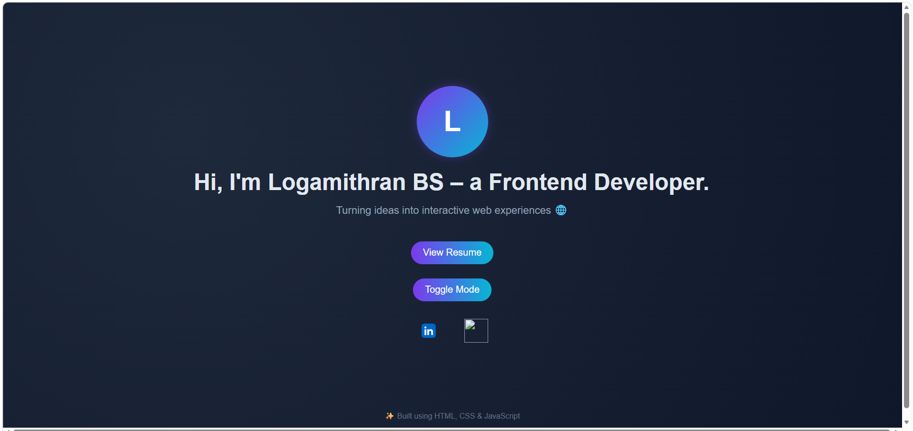

# 🌟 Beginner-Friendly Portfolio

A simple and responsive personal portfolio website designed to showcase professional information, skills, projects, and contact details. This project serves as an excellent starting point for beginners learning web development and portfolio creation.

## ✨ Features

- 👤 Personal Introduction Section
- 💼 Projects Showcase
- 🛠️ Skills Display
- 📞 Contact Information
- 📱 Responsive Design
- 🎨 Clean and Modern UI

## 🛠️ Tech Stack

- HTML5
- CSS3
- JavaScript

## 📸 Project Preview

## 🎯 Learning Outcomes

- HTML Page Structure
- CSS Styling & Layouts
- Responsive Web Design
- Portfolio Development Basics

## 👨‍💻 Author

**Logamithran**
